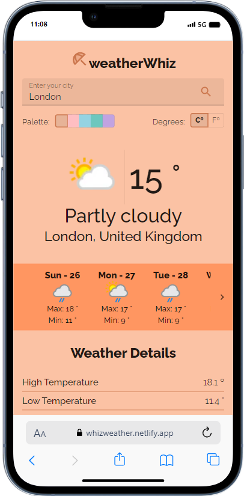

# weatherWhiz

WeatherWhiz is a reliable weather app that offers highly accurate weather forecasts.

Developed with: 
- **React**
- **Material UI**
- https://www.weatherapi.com/

## Features

- Check the weather forecast for up to 14 days.
- Get detailed information such as % humidity, wind direction, % clouds, precipitation... and more.
- Choose whether you want to check the data in Celsius or Fahrenheit.
- Explore different color palettes in the interface.

## [🚀 Live: https://whizweather.netlify.app/ ](https://whizweather.netlify.app/)

